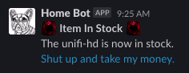

# Store UI Dot Com Scraper

Quick and dirty container that uses selenium, BeautifulSoup, chromium via python to scrape page for a basic "Sold Out" string. This is in no way optimized or anything.

If an item is in stock it returns:



Could be run via CI, `cron`, or really lazily via `watch`.

## USE

```shell
docker run -e \
URL="https://store.ui.com/collections/wireless/products/unifi-hd" \
-e SLACK_WEBHOOK="https://hooks.slack.com/services/..." \
${contianer}
```

## ENV

### `SLACK_WEBHOOK` *required*

- emoji `:red-alert_siren:` *required*
- webhook to where you want an alert posted

### `URL` *required*

- ubiquity page url, ie `https://store.ui.com/collections/routing-switching/products/udm-pro`
